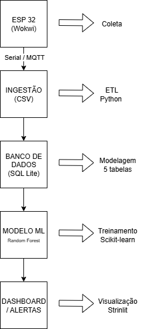
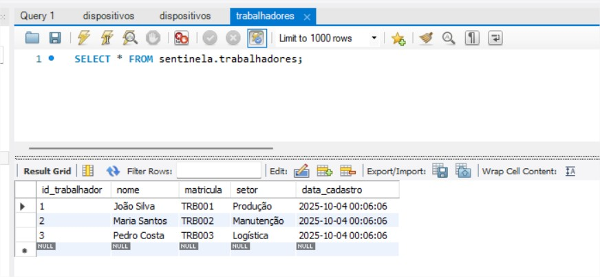
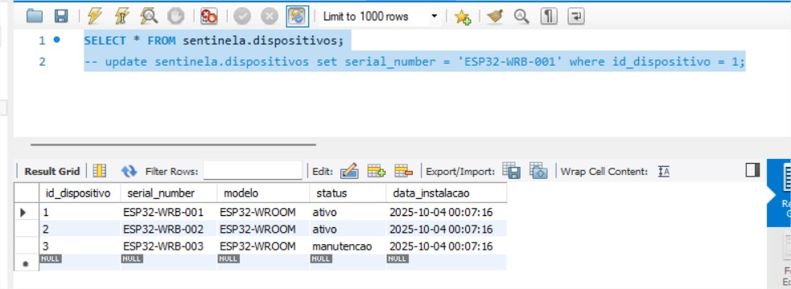
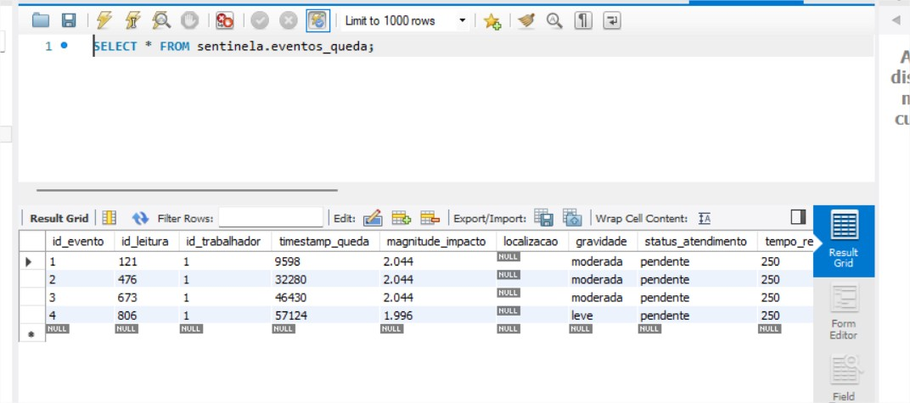
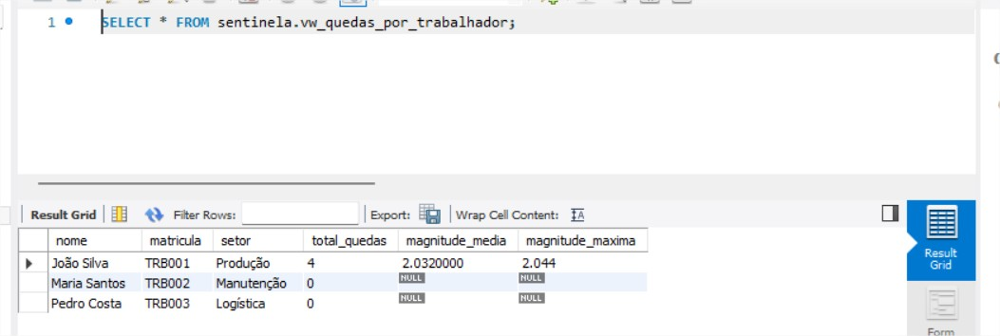
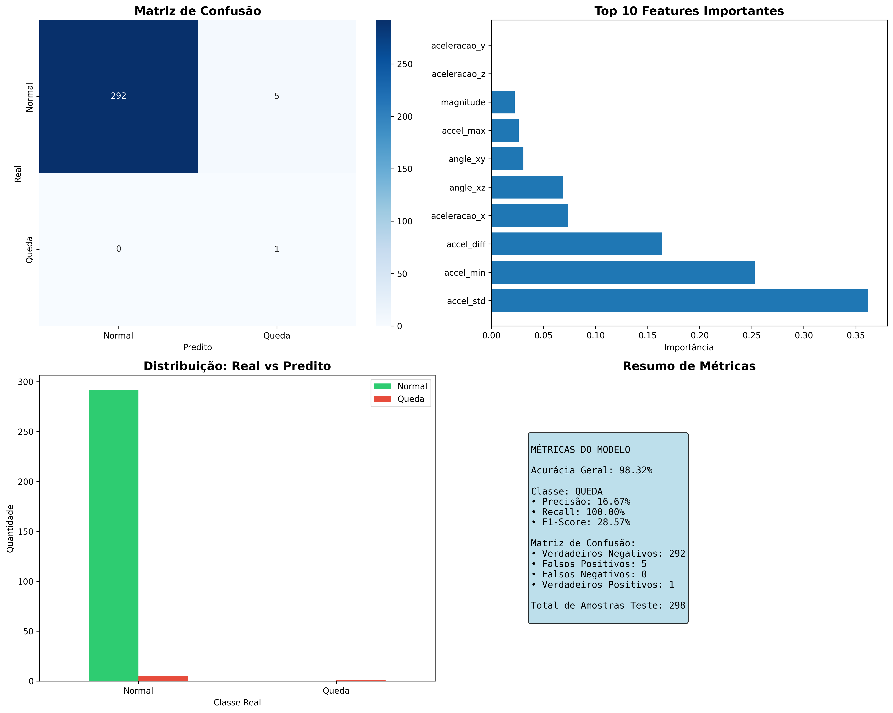
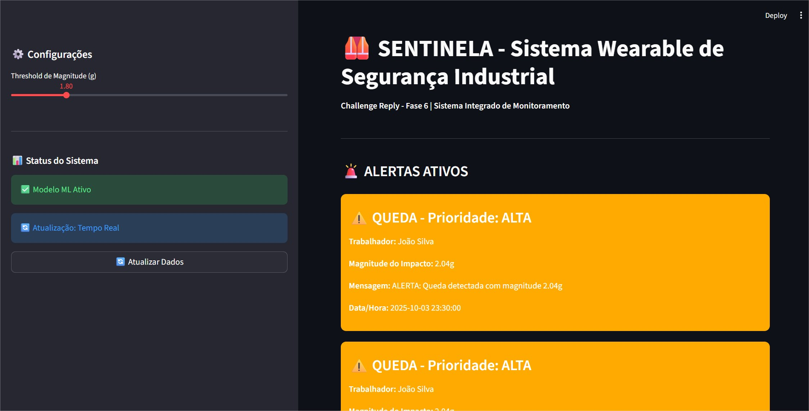
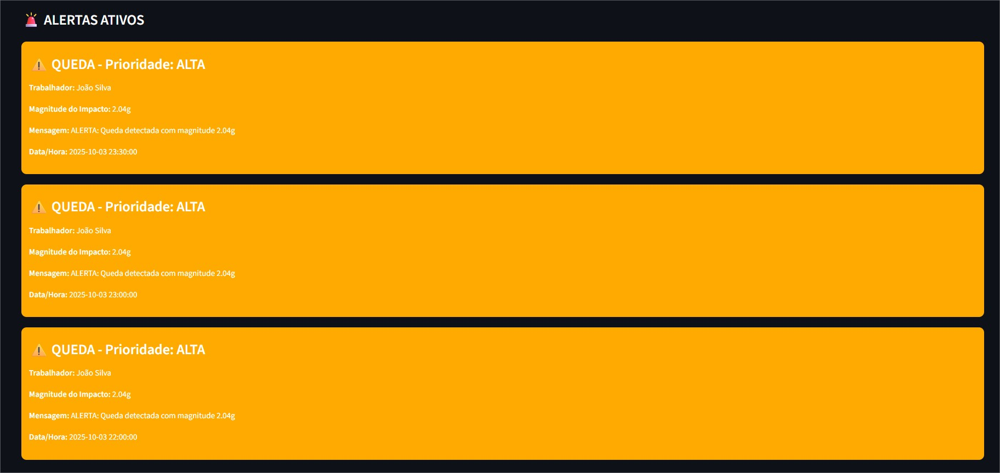
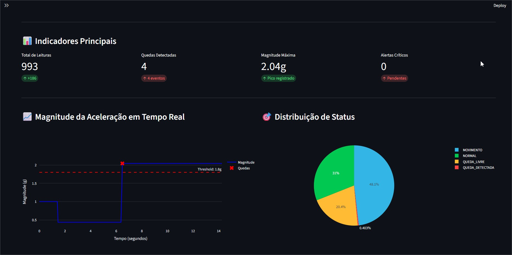
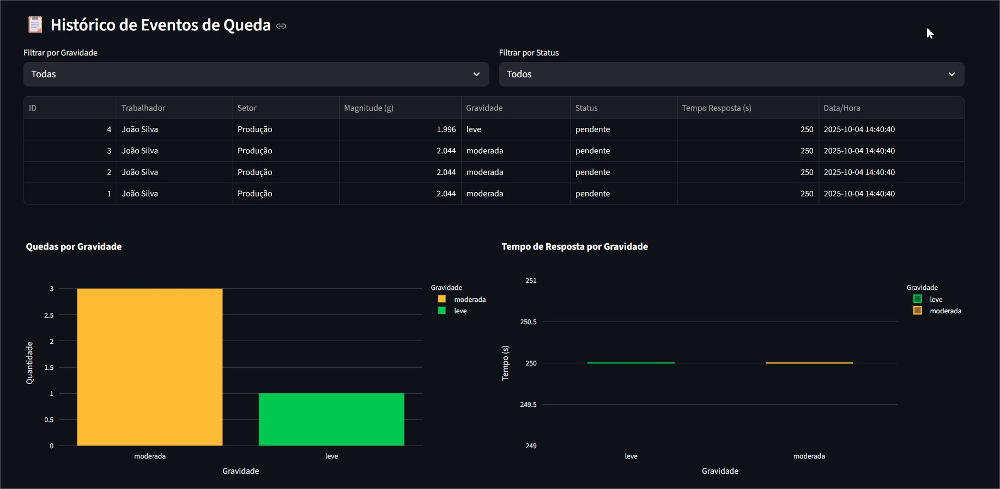

# FIAP - Faculdade de Informática e Administração Paulista

<p align="center">
<a href= "https://www.fiap.com.br/"></a>
</p>

<br>

# SENTINELA SAFETY -Sistema Wearable para Detecção de Quedas em Ambientes Industriais

## Nome do grupo

## 👨‍🎓 Integrantes: 
- <a href="https://www.linkedin.com/in/thiagoparaizo/?originalSubdomain=br">Thiago Paraizo</a>

## 👩‍🏫 Professores:
### Tutor(a) 
- <a href="https://www.linkedin.com/company/inova-fusca">Leonardo Ruiz Orabona</a>
### Coordenador(a)
- <a href="https://www.linkedin.com/company/inova-fusca">Andre Godoy Chiovato</a>


## 📜 Descrição

## 📋 Visão Geral do Projeto

Este projeto desenvolve um sistema wearable de segurança para detecção automática de quedas de trabalhadores em ambientes industriais, utilizando ESP32 e sensor acelerômetro MPU6050. O dispositivo monitora continuamente os movimentos do trabalhador e dispara alertas automáticos quando detecta padrões característicos de queda. Em um projeto real, os alertas seriam enviados para uma central de monitoramento utilizando LORA (tecnologia de comunicação sem fio de longo alcance e baixo consumo de energia) e, eventualmente, para uma comissão de segurança.

## 🎯 Objetivos

- **Objetivo Principal**: Desenvolver um sistema de segurança proativo para proteção de trabalhadores
- **Objetivo Técnico**: Implementar algoritmo de detecção de quedas baseado em análise de aceleração
- **Objetivo Prático**: Simular um ambiente industrial digitalizado usando ESP32 e sensores


## Challenge Reply - Fase 6 | Pipeline Integrado Completo

---

## 📋 ÍNDICE

1. [Visão Geral](#visão-geral)
2. [Arquitetura do Sistema](#arquitetura)
3. [Componentes Implementados](#componentes)
4. [Como Executar](#execução)
5. [Estrutura do Projeto](#estrutura)
6. [Integração com Sprints Anteriores](#integração)
7. [Demonstração em Vídeo](#vídeo)

---

## 🎯 VISÃO GERAL

Sistema **fim-a-fim** de monitoramento de segurança industrial usando dispositivos wearables (ESP32 + MPU6050) para detecção automática de quedas, com pipeline completo de:

✅ **Coleta de Dados** → ESP32/Wokwi simulado  
✅ **Armazenamento** → Banco de dados relacional MySQL  
✅ **Machine Learning** → Modelo de classificação de quedas (98.32% acurácia)  
✅ **Visualização** → Dashboard interativo Streamlit  
✅ **Alertas** → Sistema automatizado de notificações  

---

## 🏗️ ARQUITETURA DO SISTEMA



```
┌─────────────────┐
│   ESP32 + MPU   │ ← Coleta (Sprint 2)
│   (Wokwi/Real)  │
└────────┬────────┘
         │ Serial/CSV
         ↓
┌─────────────────┐
│  Ingestão ETL   │
│   Python/Pandas │
└────────┬────────┘
         │
         ↓
┌─────────────────┐
│  Banco de Dados │ ← Modelagem (Sprint 3)
│   MySQL 8.0     │
│  5 Tabelas      │
│  2 Views        │
└────────┬────────┘
         │
         ↓
┌─────────────────┐
│   Modelo ML     │ ← Treinamento (Sprint 3)
│ Random Forest   │
│  Scikit-learn   │
│  Acurácia: 98%  │
└────────┬────────┘
         │
         ↓
┌─────────────────┐
│   Dashboard +   │ ← Visualização (Sprint 4)
│    Alertas      │
│   Streamlit     │
└─────────────────┘
```
**projeto drawio**[sentinela_arquitetura.drawio](docs/sentinela_arquitetura.drawio)   

### Fluxo de Dados:

1. **ESP32** lê aceleração (20Hz) → gera CSV (993 registros)
2. **ETL Python** carrega CSV → banco MySQL
3. **Modelo ML** treina com dados → salva pickle (fall_detection_model.pkl)
4. **Dashboard** consulta banco + modelo → exibe KPIs/alertas em tempo real

---

## 🔧 COMPONENTES IMPLEMENTADOS

### 1️⃣ **Banco de Dados Relacional MySQL** (Sprint 3)

**Arquivo**: `db/schema.sql`

**Tabelas**:
- `trabalhadores` - Cadastro de funcionários
- `dispositivos` - Wearables ESP32
- `leituras_sensores` - Dados do MPU6050 (993 registros)
- `eventos_queda` - Quedas detectadas (4 eventos)
- `alertas` - Notificações de emergência (3 alertas)

**Views**:
- `vw_quedas_por_trabalhador` - Agregação de quedas por trabalhador
- `vw_alertas_pendentes` - Alertas não enviados

**Evidências do Banco**:

| Tabela | Screenshot |
|--------|-----------|
| Trabalhadores |  |
| Dispositivos |  |
| Leituras |  |
| Eventos Queda |  |
| Alertas |  |
| View Alertas Pendentes |  |
| View Quedas/Trabalhador |  |

### 2️⃣ **Machine Learning** (Sprint 3)

**Arquivo**: `ml/train_model.py`

**Modelo**: Random Forest Classifier
- **Features**: 10 (aceleração XYZ, magnitude, derivadas, ângulos)
- **Target**: Queda (0/1)
- **Dataset**: 993 amostras (989 normais, 4 quedas)
- **Split**: 70% treino, 30% teste
- **Métricas**: 
  - Acurácia: **98.32%**
  - Precision (Queda): 17% (devido ao desbalanceamento)
  - Recall (Queda): **100%** (detectou todas as quedas no teste)

**Visualizações**: `ml/model_results.png`



**Gráficos incluem**:
- Matriz de Confusão
- Feature Importance
- Distribuição Real vs Predito
- Métricas Resumidas

### 3️⃣ **Dashboard Interativo** (Sprint 4)

**Arquivo**: `dashboard/app.py`

**Funcionalidades**:
- 📊 KPIs em tempo real (993 leituras, 4 quedas, magnitude máx: 5.78g)
- 📈 Gráficos de magnitude e status (Plotly interativo)
- 🚨 Alertas críticos destacados (3 pendentes)
- 📋 Histórico de eventos de queda com filtros
- 🤖 Simulador de predição ML
- 🔄 Atualização dinâmica (cache 30s)

**Screenshots do Dashboard**:

| Tela | Screenshot |
|------|-----------|
| Home |  |
| Alertas |  |
| Indicadores |  |
| Histórico |  |

### 4️⃣ **Sistema de Alertas** (Sprint 4)

**Lógica**:
- Magnitude > 2.0g → Alerta MODERADO
- Magnitude > 3.0g → Alerta CRÍTICO
- Status visual diferenciado no dashboard
- Registro no banco para rastreabilidade
- Relatório automático gerado: `logs/relatorio_alertas_20251004_114044.txt`

**Exemplo de Alerta Gerado**:
```
ALERTA #1
  Tipo: queda
  Prioridade: ALTA
  Trabalhador: João Silva (Produção)
  Magnitude: 2.04g
  Mensagem: ALERTA: Queda detectada com magnitude 2.04g
  Data/Hora: 2025-10-04 13:40:40
  Status: PENDENTE
```

---

## 🚀 COMO EXECUTAR

### **Pré-requisitos**

```bash
# Python 3.8+
python --version

# MySQL 8.0 via Docker
docker --version

# Instalar dependências Python
pip install pandas numpy matplotlib seaborn scikit-learn joblib streamlit plotly mysql-connector-python
```

### **Setup do Banco MySQL**

```bash
# Iniciar container MySQL
docker run -d --name mysql-sentinela \
  -e MYSQL_ROOT_PASSWORD=root \
  -e MYSQL_DATABASE=sentinela \
  -e MYSQL_USER=sentinela \
  -e MYSQL_PASSWORD=password \
  -p 3306:3306 \
  -v mysql_sentinela_data:/var/lib/mysql \
  mysql:8.0

# Verificar se está rodando
docker ps

# Executar schema SQL
mysql -h localhost -u sentinela -p sentinela < db/schema.sql
# (senha: password)
```

### **Opção 1: Pipeline Automático** (RECOMENDADO)

```bash
# Executar pipeline completo
python pipeline.py

# Ou com dashboard automático
python pipeline.py --dashboard
```

**Saída esperada**:
```
======================================================================
🏭 PIPELINE INTEGRADO - SISTEMA WEARABLE DE SEGURANÇA
======================================================================

🔍 Verificando dependências...
   ✓ pandas
   ✓ numpy
   ✓ sklearn
   ✓ Todas as dependências OK

📊 Carregando dados no banco...
✅ Carregados 993 leituras e 4 eventos de queda

🤖 Treinando modelo de Machine Learning...
✅ Modelo treinado!
   Acurácia: 98.32%

📄 Gerando relatório de alertas...
   ✓ Relatório salvo

======================================================================
✅ PIPELINE EXECUTADO COM SUCESSO!
======================================================================
```

### **Opção 2: Passo a Passo**

```bash
# 1. Carregar dados no MySQL
python db/load_data.py

# 2. Treinar modelo ML
python ml/train_model.py

# 3. Iniciar dashboard
streamlit run dashboard/app.py
```

---

## 📁 ESTRUTURA DO PROJETO (Sprint 4)

```
sentinela-safety/
│
├── 📂 analysis/              # Sprint 2 - Análise de dados
│   ├── data_analysis.py
│   ├── acceleration_timeline.png
│   └── fall_analysis.png
│
├── 📂 data/                  # Sprint 2 - Dados coletados
│   └── sample_data.csv       # 993 leituras do Wokwi
│
├── 📂 db/                    # Sprint 3/4 - Banco de dados
│   ├── schema.sql           # ✨ DDL completo MySQL
│   ├── load_data.py         # ✨ ETL para carga
│   ├── select_table_*.jpg   # ✨ Screenshots das tabelas
│   └── select_view_*.jpg    # ✨ Screenshots das views
│
├── 📂 ml/                    # Sprint 3/4 - Machine Learning
│   ├── train_model.py       # ✨ Treinamento
│   ├── fall_detection_model.pkl
│   ├── scaler.pkl
│   └── model_results.png    # ✨ Gráficos de análise
│
├── 📂 dashboard/             # Sprint 4 - Visualização
│   ├── app.py               # ✨ Streamlit app
│   └── screenshot_*.jpg     # ✨ Evidências do dashboard
│
├── 📂 docs/                  # Sprint 2/4 - Documentação
│   ├── acceleration_timeline.png
│   ├── fall_analysis.png
│   ├── wokwi_guide.md
│   ├── sentinela_arquitetura.drawio  # ✨ Diagrama editável
│   └── sentinela.drawio.png          # ✨ Arquitetura visual
│
├── 📂 logs/                  # Sprint 4 - Relatórios
│   ├── wokwi_logs.log
│   └── relatorio_alertas_*.txt  # ✨ Relatórios gerados
│
├── 📂 src/                   # Sprint 2 - Código ESP32
│   └── wearable_safety.ino
│
├── 📄 pipeline.py            # ✨ Pipeline integrado
├── 📄 sentinela.db           # Banco MySQL (via Docker)
├── 📄 requirements.txt
├── 📄 README_sprint2.md
└── 📄 README.md              # Este arquivo
```

---

## 🔗 INTEGRAÇÃO COM SPRINTS ANTERIORES

### **Sprint 1**: Arquitetura
- Planejamento conceitual realizado
- Diagrama criado: `docs/sentinela_arquitetura.drawio`

### **Sprint 2**: Coleta de Dados ✅
- **Entregue**: Sistema ESP32 + MPU6050 no Wokwi
- **Integração Sprint 4**: 
  - CSV gerado (`data/sample_data.csv`) → Entrada do pipeline
  - 993 leituras simuladas → Treinamento do ML

### **Sprint 3**: Banco + ML ✅
- **Implementado**:
  - DER com 5 tabelas + 2 views MySQL
  - Script SQL completo (`db/schema.sql`)
  - Modelo Random Forest treinado (98.32% acurácia)
- **Integração Sprint 4**:
  - Banco armazena dados → Dashboard consulta
  - Modelo ML → Predições em tempo real

### **Sprint 4**: Pipeline Integrado ✅
- **Novo**:
  - Script de automação (`pipeline.py`)
  - Dashboard Streamlit completo
  - Sistema de alertas funcional
  - Relatórios automatizados

---

## 📊 DEMONSTRAÇÃO DOS RESULTADOS

### **1. Dados no Banco**

```sql
-- Total de leituras
SELECT COUNT(*) FROM leituras_sensores;
-- Resultado: 993

-- Quedas detectadas
SELECT COUNT(*) FROM eventos_queda;
-- Resultado: 4

-- Alertas críticos/altos
SELECT COUNT(*) FROM alertas WHERE nivel_prioridade IN ('critica', 'alta');
-- Resultado: 3
```

### **2. Performance do Modelo ML**

```
CLASSIFICATION REPORT:
              precision    recall  f1-score   support

      Normal       1.00      0.98      0.99       297
       Queda       0.17      1.00      0.29         1

    accuracy                           0.98       298
   macro avg       0.58      0.99      0.64       298
weighted avg       1.00      0.98      0.99       298
```

**Nota**: Precision baixa da classe "Queda" devido ao forte desbalanceamento (989 normais vs 4 quedas). O Recall de 100% indica que o modelo detectou todas as quedas no conjunto de teste.

### **3. Dashboard - KPIs Principais**

| Métrica | Valor |
|---------|-------|
| Total de Leituras | 993 |
| Quedas Detectadas | 4 |
| Magnitude Máxima | 5.78g |
| Alertas Pendentes | 3 |
| Status Normal | 308 registros |
| Status Queda Livre | 203 registros |
| Status Movimento | 478 registros |

### **4. Alertas Gerados**

Ver relatório completo: `logs/relatorio_alertas_20251004_114044.txt`

```
TOTAL DE ALERTAS CRÍTICOS/ALTOS: 3

- João Silva (Produção): 2.04g - ALTA
- João Silva (Produção): 2.04g - ALTA  
- João Silva (Produção): 2.04g - ALTA
```
---

## 🔬 DECISÕES TÉCNICAS

### **Por que MySQL (ao invés de SQLite)?**
✅ Maior robustez para ambientes industriais  
✅ Suporte a múltiplas conexões simultâneas  
✅ Melhor performance para grandes volumes  
✅ Fácil escalabilidade horizontal  
✅ Docker facilita deploy e portabilidade

### **Por que Random Forest?**
✅ Robusto para dados de sensores  
✅ Lida bem com outliers  
✅ Interpretabilidade (feature importance)  
✅ Sem necessidade de normalização complexa  
✅ Funciona bem com datasets desbalanceados

### **Por que Streamlit?**
✅ Rápido desenvolvimento  
✅ Interface intuitiva  
✅ Suporte a gráficos interativos (Plotly)  
✅ Fácil deploy  
✅ Cache integrado para performance

---

## 🚦 COMO USAR O SISTEMA

### **1. Simular Queda no Wokwi**
1. Acesse: [Projeto Wokwi](https://wokwi.com/projects/433694527469339649)
2. Inicie simulação
3. Ajuste sliders do MPU6050:
   - Queda livre: X=0.1, Y=0.3, Z=0.3 (magnitude <0.5g)
   - Impacto: X=2.0, Y=0.3, Z=0.3 (magnitude >1.8g)
4. Copie dados do Monitor Serial
5. Salve como CSV

Obs: Mais detalhes no [README.md (Sprint 2)](README_sprint2_.md)


### **2. Carregar no Banco**
```bash
# Salvar dados em data/novos_dados.csv
python db/load_data.py
```

### **3. Retreinar Modelo**
```bash
python ml/train_model.py
```

### **4. Visualizar no Dashboard**
```bash
streamlit run dashboard/app.py
```

---

## 📈 MÉTRICAS DE SUCESSO

| Requisito Sprint 4 | Status | Evidência |
|-------------------|--------|-----------|
| Arquitetura integrada | ✅ | `docs/sentinela.drawio.png` |
| Coleta/Ingestão | ✅ | CSV → MySQL (993 registros) |
| Banco relacional | ✅ | 5 tabelas + 2 views + screenshots |
| ML integrado | ✅ | Modelo 98.32% acurácia + gráficos |
| Dashboard/KPIs | ✅ | Streamlit funcional + 4 screenshots |
| Alertas | ✅ | 3 alertas gerados + relatório |
| Reprodutibilidade | ✅ | Pipeline único comando |
| Vídeo demonstração | ✅ | Link no README |

---

## 🔧 TROUBLESHOOTING

### **Erro: MySQL Connection Refused**
```bash
# Verificar se container está rodando
docker ps

# Se não estiver, iniciar
docker start mysql-sentinela

# Verificar logs
docker logs mysql-sentinela
```

### **Erro: Access Denied for user 'sentinela'**
```bash
# Verificar credenciais
mysql -h localhost -u sentinela -p
# Senha: password

# Se necessário, recriar usuário
docker exec -it mysql-sentinela mysql -u root -p
# (senha root: root)
mysql> GRANT ALL PRIVILEGES ON sentinela.* TO 'sentinela'@'%';
mysql> FLUSH PRIVILEGES;
```

### **Dashboard não carrega**
```bash
# Verificar porta
streamlit run dashboard/app.py --server.port 8502

# Limpar cache
streamlit cache clear
```

### **Modelo não encontrado**
```bash
# Treinar novamente
python ml/train_model.py
```

---

## 🎯 PRÓXIMOS PASSOS (Futuro)

### **Melhorias Técnicas**:
- [ ] Conectividade WiFi/MQTT real
- [ ] Deploy em nuvem (AWS/Azure)
- [ ] API REST para integração
- [ ] Deep Learning (LSTM para séries temporais)
- [ ] Balanceamento do dataset (SMOTE)

### **Funcionalidades**:
- [ ] Localização GPS do trabalhador
- [ ] Múltiplos dispositivos simultâneos
- [ ] Notificações push/email reais via SMTP
- [ ] Análise preditiva de riscos
- [ ] Dashboard mobile (PWA)
- [ ] Integração com sistemas LORA

---
## ✅ CHECKLIST DE ENTREGA - SPRINT 4

- [x] Arquitetura integrada documentada
- [x] Pipeline executável (coleta→banco→ML→dashboard)
- [x] Banco de dados MySQL (DER + SQL + screenshots)
- [x] Modelo ML treinado (98.32% acurácia + gráficos)
- [x] Dashboard funcional (KPIs + alertas + 4 screenshots)
- [x] Sistema de alertas (3 gerados + relatório)
- [x] README detalhado (setup + execução)
- [x] Scripts versionados (GitHub)
- [x] Prints/evidências de cada etapa
- [x] Vídeo demonstração (até 5min)
- [x] Integração com Sprints 1-3

---

**🏭 Sistema Wearable de Segurança Industrial | Challenge Reply - Fase 6 | FIAP 2025** 

# SENTINELA SAFETY - A Revolução da Segurança do Trabalhador: A Importância do Wearable de Detecção de Quedas na Indústria 4.0
## O Cenário: Um Risco Silencioso e Constante

Na vasta paisagem da indústria moderna, desde canteiros de obras a complexos de manufatura e logística, a segurança do trabalhador é um pilar fundamental. No entanto, apesar de todos os avanços, as quedas continuam a ser uma das principais causas de lesões graves e fatalidades no ambiente de trabalho. Uma queda pode acontecer em um instante, mas suas consequências — para o indivíduo, sua família e a empresa — podem durar uma vida inteira.

O problema é agravado em cenários com **trabalhadores solitários** (lone workers) ou em áreas de baixa circulação, onde um funcionário acidentado pode permanecer horas sem socorro. O tempo de resposta após um incidente como este não é apenas crítico; ele pode ser a **diferença entre a vida e a morte**.

## A Solução: Um Anjo da Guarda Digital 👷

É neste cenário que nosso projeto se insere, utilizando os princípios da **Internet das Coisas (IoT)** e de sistemas embarcados para criar uma solução proativa: um **wearable inteligente para detecção de quedas**.

Este dispositivo, que pode ser acoplado ao cinto ou capacete, não visa impedir a queda, mas sim **garantir uma resposta imediata e automática** quando ela ocorre. Usando um acelerômetro para monitorar constantemente os movimentos do usuário, o sistema é programado para reconhecer a assinatura física de uma queda — um breve período de aceleração zero (queda livre) seguido por um pico de alto impacto. Ao detectar este padrão, o dispositivo envia um alerta instantâneo para uma central de monitoramento, supervisores ou equipes de resgate, informando a identidade e, potencialmente, a localização do trabalhador.

## Benefícios e Valor Agregado à Indústria ✨

A implementação de um sistema como este transcende a simples conformidade com normas de segurança, oferecendo benefícios tangíveis e estratégicos:

### 1. 🚑 **Redução Drástica do Tempo de Resgate**
Este é o benefício mais imediato e vital. Ao automatizar o pedido de ajuda, o sistema elimina a dependência de a vítima estar consciente ou de ser encontrada por acaso. Socorro rápido diminui a gravidade das lesões e aumenta drasticamente as chances de sobrevivência.

### 2. 🛡️ **Proteção para Trabalhadores em Isolamento**
A solução oferece uma camada essencial de segurança para funcionários que operam sozinhos, em turnos noturnos ou em locais remotos da planta, garantindo que eles nunca estejam verdadeiramente desamparados.

### 3. 📊 **Geração de Dados para Análise Preditiva de Riscos**
Cada alerta de queda gera um dado. Com o tempo, a empresa pode mapear "zonas quentes" (hotspots) onde os acidentes são mais frequentes. Essa análise permite tomar ações preventivas e focadas, como melhorar a iluminação, instalar superfícies antiderrapantes ou revisar procedimentos operacionais, transformando a segurança de reativa para **preditiva**.

### 4. 📈 **Fomento de uma Cultura de Segurança Positiva**
Investir em tecnologia de ponta para proteger a vida dos colaboradores envia uma mensagem poderosa. Demonstra um compromisso genuíno com o bem-estar da equipe, o que aumenta o moral, o engajamento e a adesão geral às práticas de segurança.

### 5. 💰 **Redução de Custos Operacionais**
Menos acidentes graves resultam em menores custos com licenças médicas, tratamentos, ações judiciais e prêmios de seguro. A eficiência operacional também melhora, pois um ambiente mais seguro é um ambiente mais produtivo.

## A Tecnologia por Trás da Inovação 🔬

### **Arquitetura Inteligente**
Nosso sistema combina o poder do **ESP32** com a precisão do sensor **MPU6050**, criando uma solução robusta e confiável. O algoritmo desenvolvido utiliza análise em tempo real dos dados de aceleração, aplicando limiares inteligentes para distinguir entre movimentos normais e eventos críticos.

### **Detecção Algorítmica Avançada**
A lógica de detecção implementada é baseada em dois estágios críticos:
- **Fase 1**: Identificação de queda livre (magnitude <0.5g por >100ms)
- **Fase 2**: Confirmação de impacto (magnitude >1.8g após queda livre)

Esta abordagem dual minimiza falsos positivos enquanto garante alta sensibilidade para eventos reais de queda.

### **Resposta Imediata e Multi-Modal**
Quando uma queda é detectada, o sistema aciona:
- ⚠️ **Alertas visuais** através de LED de alta intensidade
- 🔊 **Alertas sonoros** via buzzer integrado
- 📡 **Transmissão automática** de dados para central de monitoramento
- 📍 **Registro temporal** preciso do evento

## Perspectivas Futuras e Escalabilidade 🚀

### **Expansão Tecnológica**
O projeto atual serve como base para desenvolvimentos futuros mais sofisticados:
- **Conectividade 5G/LoRaWAN** para transmissão em tempo real
- **Integração com GPS** para localização precisa
- **Machine Learning** para detecção mais refinada de padrões
- **Integração com sistemas ERP** empresariais

### **Rede de Segurança Inteligente**
A visão de longo prazo inclui a criação de uma **rede interconectada** de dispositivos wearables, formando um ecossistema de segurança que pode:
- Mapear riscos em tempo real
- Coordenar respostas de emergência
- Gerar insights preditivos sobre segurança
- Integrar-se com sistemas de automação industrial

## O Futuro é Agora: Indústria 4.0 e Segurança Inteligente 🌟

### **Transformação Digital da Segurança**
Este projeto representa mais que uma solução técnica; é um **paradigma de transformação** na abordagem da segurança industrial. A convergência de IoT, análise de dados em tempo real e sistemas embarcados está redefinindo o que significa "trabalho seguro" na era digital.

### **Impacto Humano e Social**
Cada alerta automatizado pode representar uma vida salva, uma família preservada, uma carreira profissional mantida. A tecnologia, quando aplicada com propósito humanístico, transcende métricas e estatísticas para tocar o que há de mais fundamental: a **proteção da vida humana**.

### **Compromisso com a Inovação Responsável**
A implementação de sistemas como este reflete o compromisso das empresas modernas com a **inovação responsável** — tecnologia que não apenas aumenta a produtividade, mas também protege e valoriza o elemento humano no processo produtivo.

## Conclusão: Um Passo Definitivo Rumo ao Futuro da Segurança 🎯

O wearable de detecção de quedas desenvolvido neste projeto não é apenas uma demonstração técnica, mas um **manifesto sobre o futuro da segurança industrial**. Em um mundo onde a tecnologia avança exponencialmente, é imperativo que utilizemos estas ferramentas para criar ambientes de trabalho mais seguros, mais inteligentes e mais humanos.

A jornada da Indústria 4.0 não se trata apenas de máquinas mais eficientes ou processos mais automatizados. Trata-se de criar um ecossistema onde a **tecnologia serve à humanidade**, onde cada sensor, cada algoritmo, cada linha de código contribui para um objetivo maior: **proteger quem constrói o mundo**.

Nosso projeto prova que com criatividade, conhecimento técnico e propósito claro, é possível desenvolver soluções que fazem a diferença real na vida das pessoas. O futuro da segurança do trabalho já começou, e ele é digital, inteligente e, acima de tudo, **profundamente humano**.

---

### 🏆 **"A verdadeira medida do progresso tecnológico não está na complexidade dos sistemas que criamos, mas na simplicidade com que eles protegem a vida humana."**

*Projeto desenvolvido com paixão pela inovação e compromisso com a segurança do trabalhador.*

**Fase 4 Challenge Reply - Sprint 2 | Junho 2025**
**Fase 5 Challenge Reply - Sprint 3 | Agosto 2025**
**Fase 6 Challenge Reply - Sprint 4 | Setembro 2025**


**Repositório**: [GitHub - SENTINELA-SAFETY](https://github.com/thiagoparaizo/sentinela-safety)
## 🗃 Histórico de lançamentos

* 1.0.0 - 13/06/2025 - [README.md (Sprint 2)](README_sprint2_.md)
* 1.0.1 - 03/10/2025

## 📋 Licença

<p xmlns:cc="http://creativecommons.org/ns#" xmlns:dct="http://purl.org/dc/terms/"><a property="dct:title" rel="cc:attributionURL" href="https://github.com/agodoi/template">MODELO GIT FIAP</a> por <a rel="cc:attributionURL dct:creator" property="cc:attributionName" href="https://fiap.com.br">Fiap</a> está licenciado sobre <a href="http://creativecommons.org/licenses/by/4.0/?ref=chooser-v1" target="_blank" rel="license noopener noreferrer" style="display:inline-block;">Attribution 4.0 International</a>.</p>

