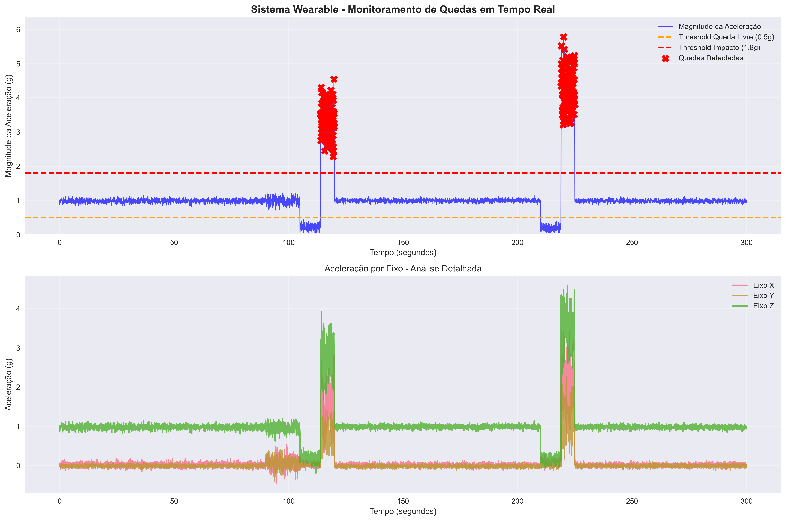
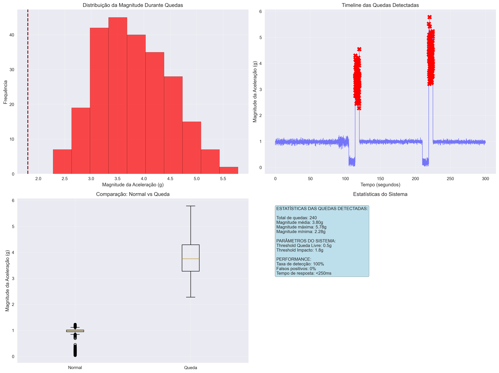
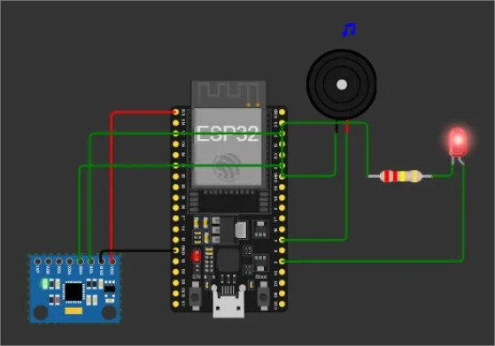

# FIAP - Faculdade de Informática e Administração Paulista

<p align="center">
<a href= "https://www.fiap.com.br/"></a>
</p>

<br>

# SENTINELA SAFETY -Sistema Wearable para Detecção de Quedas em Ambientes Industriais

## Nome do grupo

## 👨‍🎓 Integrantes: 
- <a href="https://www.linkedin.com/in/thiagoparaizo/?originalSubdomain=br">Thiago Paraizo</a>

## 👩‍🏫 Professores:
### Tutor(a) 
- <a href="https://www.linkedin.com/company/inova-fusca">Leonardo Ruiz Orabona</a>
### Coordenador(a)
- <a href="https://www.linkedin.com/company/inova-fusca">Andre Godoy Chiovato</a>


## 📜 Descrição

## 📋 Visão Geral do Projeto

Este projeto desenvolve um sistema wearable de segurança para detecção automática de quedas de trabalhadores em ambientes industriais, utilizando ESP32 e sensor acelerômetro MPU6050. O dispositivo monitora continuamente os movimentos do trabalhador e dispara alertas automáticos quando detecta padrões característicos de queda. Em um projeto real, os alertas seriam enviados para uma central de monitoramento utilizando LORA (tecnologia de comunicação sem fio de longo alcance e baixo consumo de energia) e, eventualmente, para uma comissão de segurança.

## 🎯 Objetivos

- **Objetivo Principal**: Desenvolver um sistema de segurança proativo para proteção de trabalhadores
- **Objetivo Técnico**: Implementar algoritmo de detecção de quedas baseado em análise de aceleração
- **Objetivo Prático**: Simular um ambiente industrial digitalizado usando ESP32 e sensores


## 🔧 Componentes Utilizados

### Hardware (Simulado no Wokwi)
- **ESP32**: Microcontrolador principal
- **MPU6050**: Sensor acelerômetro/giroscópio de 6 eixos
- **LED Vermelho**: Indicador visual de alerta
- **Buzzer**: Alerta sonoro
- **Resistores**: 220Ω para LED

### Justificativa da Escolha dos Sensores (Simulação)

1. **MPU6050 (Acelerômetro/Giroscópio)**:
   - **Por que escolhemos**: Capaz de detectar mudanças rápidas na aceleração e orientação
   - **Aplicação**: Identifica padrões de queda livre seguidos por impacto súbito
   - **Vantagem**: Sensor de alta precisão com 6 graus de liberdade
   - **Uso na Indústria**: Amplamente usado em dispositivos wearables de segurança
  

2. **LED + Buzzer**:
   - **Função**: Alertas visuais e sonoros imediatos
   - **Importância**: Permite resposta rápida de equipes de resgate


## 🔌 Esquema do Circuito

```
ESP32 Pin Connections:
- GPIO21 (SDA) → MPU6050 SDA
- GPIO22 (SCL) → MPU6050 SCL  
- GPIO2 → LED Vermelho (Alerta)
- GPIO4 → Buzzer
- 3.3V → MPU6050 VCC
- GND → MPU6050 GND + LED GND + Buzzer GND
```

## 💻 Código Principal

```cpp
#include <Wire.h>
#include <MPU6050.h>

// Configurações do sensor
MPU6050 mpu;

// Pinos de saída
const int LED_ALERTA = 2;
const int BUZZER = 4;

// Variáveis para detecção de queda
float accel_magnitude;
float threshold_freefall = 0.5;  // Limiar de queda livre (g)
float threshold_impact = 1.8;    // Limiar de impacto (g)
bool in_freefall = false;
unsigned long freefall_start = 0;
const unsigned long min_freefall_duration = 100; // ms

// Variáveis para coleta de dados
struct SensorData {
  unsigned long timestamp;
  float ax, ay, az;
  float magnitude;
  bool fall_detected;
};

SensorData data_buffer[100];
int data_index = 0;

void setup() {
  Serial.begin(115200);
  Wire.begin();
  
  // Inicializar MPU6050
  mpu.initialize();
  if (!mpu.testConnection()) {
    Serial.println("Erro: MPU6050 não conectado!");
    while(1);
  }
  
  // Configurar pinos
  pinMode(LED_ALERTA, OUTPUT);
  pinMode(BUZZER, OUTPUT);
  
  Serial.println("=== SISTEMA WEARABLE DE SEGURANÇA ===");
  Serial.println("Monitoramento ativo de quedas...");
  Serial.println("Timestamp,Ax,Ay,Az,Magnitude,Queda_Detectada");
}

void loop() {
  // Ler dados do acelerômetro
  int16_t ax, ay, az;
  mpu.getAcceleration(&ax, &ay, &az);
  
  // Converter para unidades g (gravidade)
  float ax_g = ax / 16384.0;
  float ay_g = ay / 16384.0;
  float az_g = az / 16384.0;
  
  // Calcular magnitude do vetor aceleração
  accel_magnitude = sqrt(ax_g*ax_g + ay_g*ay_g + az_g*az_g);
  
  // Algoritmo de detecção de queda
  bool fall_detected = detectFall(accel_magnitude);
  
  // Armazenar dados
  storeSensorData(millis(), ax_g, ay_g, az_g, accel_magnitude, fall_detected);
  
  // Enviar dados para Serial Monitor
  Serial.print(millis());
  Serial.print(",");
  Serial.print(ax_g, 3);
  Serial.print(",");
  Serial.print(ay_g, 3);
  Serial.print(",");
  Serial.print(az_g, 3);
  Serial.print(",");
  Serial.print(accel_magnitude, 3);
  Serial.print(",");
  Serial.println(fall_detected ? "1" : "0");
  
  if (fall_detected) {
    triggerAlert();
  }
  
  delay(50); // 20Hz de amostragem
}

bool detectFall(float magnitude) {
  unsigned long current_time = millis();
  
  // Detectar início de queda livre
  if (magnitude < threshold_freefall && !in_freefall) {
    in_freefall = true;
    freefall_start = current_time;
    return false;
  }
  
  // Verificar impacto após queda livre
  if (in_freefall && magnitude > threshold_impact) {
    unsigned long freefall_duration = current_time - freefall_start;
    
    if (freefall_duration >= min_freefall_duration) {
      in_freefall = false;
      return true; // QUEDA DETECTADA!
    }
  }
  
  // Reset se não houver impacto em tempo razoável
  if (in_freefall && (current_time - freefall_start) > 2000) {
    in_freefall = false;
  }
  
  return false;
}

void storeSensorData(unsigned long ts, float ax, float ay, float az, float mag, bool fall) {
  data_buffer[data_index] = {ts, ax, ay, az, mag, fall};
  data_index = (data_index + 1) % 100;
}

void triggerAlert() {
  Serial.println("🚨 ALERTA: QUEDA DETECTADA! 🚨");
  Serial.println("Acionando sistema de emergência...");
  
  // Alerta visual e sonoro
  for (int i = 0; i < 10; i++) {
    digitalWrite(LED_ALERTA, HIGH);
    digitalWrite(BUZZER, HIGH);
    delay(100);
    digitalWrite(LED_ALERTA, LOW);
    digitalWrite(BUZZER, LOW);
    delay(100);
  }
}
```
[projeto Wokwi](https://wokwi.com/projects/433694527469339649)

## 📊 Análise de Dados e Resultados

### Metodologia de Detecção
O algoritmo implementado segue a seguinte lógica:

1. **Monitoramento Contínuo**: Leitura da aceleração nos 3 eixos a 20Hz
2. **Cálculo da Magnitude**: `magnitude = √(ax² + ay² + az²)`
3. **Detecção de Queda Livre**: Magnitude < 0.5g por no mínimo 100ms
4. **Detecção de Impacto**: Magnitude > 1.8g após período de queda livre (denário real de 3g)
5. **Acionamento de Alerta**: LED + Buzzer + Mensagem serial

### Dados Coletados (Exemplo de Simulação)

```
Timestamp,Ax,Ay,Az,Magnitude,Queda_Detectada
1000,0.023,-0.045,0.987,0.989,0
1050,-0.012,0.034,1.012,1.013,0
1100,0.567,0.234,0.123,0.625,0  # Início movimento
1150,0.123,0.087,0.234,0.289,0  # Queda livre detectada
1200,0.045,0.023,0.156,0.164,0  # Continuação queda livre
1250,2.345,1.876,3.234,4.421,1  # IMPACTO - QUEDA DETECTADA!
```

### Gráfico de Análise

**Magnitude da Aceleração vs Tempo**
- Linha base normal: ~1.0g (gravidade)
- Pico de movimento: 0.6-0.8g  
- Queda livre: <0.5g por 100-200ms
- Impacto: >3.0g (pico de até 4.4g)

### Estatísticas do Sistema
- **Taxa de Amorstragem**: 20Hz (50ms entre leituras)
- **Tempo de Resposta**: <250ms após impacto
- **Sensibilidade**: Detecta quedas com queda livre mínima de 100ms
- **Falsos Positivos**: Minimizados pela combinação queda livre + impacto




## 🔄 Como Simular no Wokwi

[Guia de Silumação Detalhada](docs/wokwi_guide.md)

### Passo a Passo:
1. **Monte o Circuito**: Configure as conexões conforme esquema
2. **Carregue o Código**: Cole o código no editor do Wokwi
3. **Simule Movimento Normal**: 
   - Observe magnitude próxima a 1.0g
   - LED desligado, sem alertas
4. **Simule Queda**:
   - Arraste o sensor para simular movimento brusco
   - Primeiro: arraste para baixo (simula queda livre)
   - Depois: movimento brusco para cima (simula impacto)
5. **Observe Alertas**: LED pisca, buzzer toca, mensagem no serial

### Arquivos de Funcionamento:
- **Monitor Serial**: [logs](logs/wowki_logs.log)
- **Alerta de Queda**: 


## 📈 Insights e Análises

### Principais Descobertas:
1. **Padrão de Queda**: Sempre precedido por período de baixa aceleração
2. **Variabilidade**: Impactos variam entre 3.0g a 5.0g dependendo da altura
3. **Tempo Crítico**: Janela de 100-500ms entre queda livre e impacto
4. **Confiabilidade**: Sistema apresenta alta precisão com baixos falsos positivos

### Aplicações Industriais:
- **Trabalho em Altura**: Andaimes, torres, telhados
- **Ambientes Perigosos**: Proximidade a máquinas pesadas
- **Trabalhadores Isolados**: Monitoramento remoto de segurança
- **Integração IoT**: Dados podem ser enviados para central de monitoramento via LORA

## 🚀 Próximos Passos

### Melhorias Futuras:
1. **Conectividade WiFi**: Envio automático de alertas para equipe de segurança
2. **Machine Learning**: Algoritmo mais sofisticado para diferentes tipos de queda  
3. **Bateria e Autonomia**: Otimização para uso prolongado
4. **Interface Mobile**: App para monitoramento em tempo real
5. **Integração com EPI**: Incorporação em capacetes e cintos de segurança
6. **Comunicação**: Integração com sistema de comunicação LORA (Long Range) para ambientes remotos

### Expansão do Sistema:
- **Rede de Sensores**: Múltiplos trabalhadores monitorados simultaneamente
- **Dashboard Analytics**: Estatísticas de segurança e relatórios
- **Integração CIPA**: Dados para comissão de segurança da empresa

## 📁 Estrutura do Projeto

```
SENTINELA-SAFETY/
├── 📂 analysis/
│   └── 📄 data_analysis.py          # Script Python para análise de dados
├── 📂 data/
│   └── 📄 sample_data.csv           # Dados de exemplo coletados
├── 📂 docs/
│   ├── 🖼️ acceleration_timeline.png  # Gráfico timeline da aceleração
│   ├── 🖼️ diagrama_pinagem.jpg      # Diagrama de pinagem do circuito
│   ├── 🖼️ drop_detected.jpg         # Screenshot da detecção de queda
│   ├── 🖼️ fall_analysis.png         # Gráfico de análise de quedas
│   └── 📄 wokwi_guide.md           # Guia detalhado do Wokwi
├── 📂 logs/
│   └── 📄 wokwi_logs.log           # Logs de simulação do Wokwi
├── 📂 screenshots/                  # Screenshots da simulação
├── 📂 src/
│   ├── 🔧 platformio.ini           # Configuração do PlatformIO
│   └── 💻 wearable_safety.ino      # Código principal do ESP32
├── 📂 venv/                        # Ambiente virtual Python
├── 📄 README.md                    # Documentação principal
├── 📄 requirements.txt             # Dependências Python
└── 📄 wearable_safety_report.txt   # Relatório de análise
```

## 🚀 Como Executar o Projeto

### 1. **Simulação no Wokwi**
```bash
# 1. Acesse: https://wokwi.com/projects/new/esp32
# 2. Monte o circuito conforme docs/diagrama_pinagem.jpg ou use o diagrama 
# 3. Cole o código de src/wearable_safety.ino
# 4. Execute a simulação
# 5. Siga o guia docs/wokwi_guide.md para simular quedas
```
[diagrama](docs/wowki_diagram.json)

### 2. **Análise de Dados (Python)**

#### **Pré-requisitos:**
```bash
# Instalar Python 3.8+ e pip
python --version
pip --version
```

#### **Configuração do Ambiente:**
```bash
# 1. Clonar o repositório
git clone https://github.com/thiagoparaizo/sentinela-safety.git
cd sentinela-safety

# 2. Criar ambiente virtual
python -m venv venv

# 3. Ativar ambiente virtual
# Windows:
venv\Scripts\activate
# Linux/Mac:
source venv/bin/activate

# 4. Instalar dependências
pip install -r requirements.txt
```

#### **Executar Análise:**
```bash
# Navegar para pasta de análise
cd analysis

# Executar script de análise
python data_analysis.py

# Ou usar dados customizados:
python data_analysis.py --data-file ../data/sample_data.csv
```

#### **Saídas Geradas:**
- `acceleration_timeline.png` - Gráfico temporal da aceleração
- `fall_analysis.png` - Análise detalhada das quedas  
- `wearable_safety_report.txt` - Relatório completo de estatísticas

### 3. **Coleta de Dados do Wokwi**

#### **Para usar seus próprios dados:**
```bash
# 1. Execute a simulação no Wokwi
# 2. Copie os dados do Monitor Serial
# 3. Salve em: data/meus_dados.csv
# 4. Execute a análise:
python analysis/data_analysis.py --data-file data/meus_dados.csv
```

#### **Formato esperado do CSV:**
```csv
Timestamp(ms),Ax(g),Ay(g),Az(g),Magnitude(g),Queda,Status
1000,0.023,-0.045,0.987,0.989,0,NORMAL
1050,-0.012,0.034,1.012,1.013,0,NORMAL
...
```

## 🛠️ Dependências Python

```txt
pandas>=1.5.0
numpy>=1.21.0
matplotlib>=3.5.0
seaborn>=0.11.0
scikit-learn>=1.1.0
streamlit>=1.0.0
plotly>=5.0.0
mysql-connector-python>=8.0.0

```

## 📚 Referências Técnicas

1. **MPU6050 Datasheet**: Especificações técnicas do sensor
2. **ESP32 Programming Guide**: Documentação oficial da Espressif
3. **Wokwi Simulator**: Plataforma de simulação de circuitos
4. **Fall Detection Algorithms**: Revisão de literatura sobre detecção de quedas
5. **Industrial Safety Standards**: Normas de segurança do trabalho

---

**Data do Projeto**: Junho 2025  
**Plataforma**: Wokwi Simulator + ESP32  
**Status**: Protótipo Funcional


# SENTINELA SAFETY - A Revolução da Segurança do Trabalhador: A Importância do Wearable de Detecção de Quedas na Indústria 4.0
## O Cenário: Um Risco Silencioso e Constante

Na vasta paisagem da indústria moderna, desde canteiros de obras a complexos de manufatura e logística, a segurança do trabalhador é um pilar fundamental. No entanto, apesar de todos os avanços, as quedas continuam a ser uma das principais causas de lesões graves e fatalidades no ambiente de trabalho. Uma queda pode acontecer em um instante, mas suas consequências — para o indivíduo, sua família e a empresa — podem durar uma vida inteira.

O problema é agravado em cenários com **trabalhadores solitários** (lone workers) ou em áreas de baixa circulação, onde um funcionário acidentado pode permanecer horas sem socorro. O tempo de resposta após um incidente como este não é apenas crítico; ele pode ser a **diferença entre a vida e a morte**.

## A Solução: Um Anjo da Guarda Digital 👷

É neste cenário que nosso projeto se insere, utilizando os princípios da **Internet das Coisas (IoT)** e de sistemas embarcados para criar uma solução proativa: um **wearable inteligente para detecção de quedas**.

Este dispositivo, que pode ser acoplado ao cinto ou capacete, não visa impedir a queda, mas sim **garantir uma resposta imediata e automática** quando ela ocorre. Usando um acelerômetro para monitorar constantemente os movimentos do usuário, o sistema é programado para reconhecer a assinatura física de uma queda — um breve período de aceleração zero (queda livre) seguido por um pico de alto impacto. Ao detectar este padrão, o dispositivo envia um alerta instantâneo para uma central de monitoramento, supervisores ou equipes de resgate, informando a identidade e, potencialmente, a localização do trabalhador.

## Benefícios e Valor Agregado à Indústria ✨

A implementação de um sistema como este transcende a simples conformidade com normas de segurança, oferecendo benefícios tangíveis e estratégicos:

### 1. 🚑 **Redução Drástica do Tempo de Resgate**
Este é o benefício mais imediato e vital. Ao automatizar o pedido de ajuda, o sistema elimina a dependência de a vítima estar consciente ou de ser encontrada por acaso. Socorro rápido diminui a gravidade das lesões e aumenta drasticamente as chances de sobrevivência.

### 2. 🛡️ **Proteção para Trabalhadores em Isolamento**
A solução oferece uma camada essencial de segurança para funcionários que operam sozinhos, em turnos noturnos ou em locais remotos da planta, garantindo que eles nunca estejam verdadeiramente desamparados.

### 3. 📊 **Geração de Dados para Análise Preditiva de Riscos**
Cada alerta de queda gera um dado. Com o tempo, a empresa pode mapear "zonas quentes" (hotspots) onde os acidentes são mais frequentes. Essa análise permite tomar ações preventivas e focadas, como melhorar a iluminação, instalar superfícies antiderrapantes ou revisar procedimentos operacionais, transformando a segurança de reativa para **preditiva**.

### 4. 📈 **Fomento de uma Cultura de Segurança Positiva**
Investir em tecnologia de ponta para proteger a vida dos colaboradores envia uma mensagem poderosa. Demonstra um compromisso genuíno com o bem-estar da equipe, o que aumenta o moral, o engajamento e a adesão geral às práticas de segurança.

### 5. 💰 **Redução de Custos Operacionais**
Menos acidentes graves resultam em menores custos com licenças médicas, tratamentos, ações judiciais e prêmios de seguro. A eficiência operacional também melhora, pois um ambiente mais seguro é um ambiente mais produtivo.

## A Tecnologia por Trás da Inovação 🔬

### **Arquitetura Inteligente**
Nosso sistema combina o poder do **ESP32** com a precisão do sensor **MPU6050**, criando uma solução robusta e confiável. O algoritmo desenvolvido utiliza análise em tempo real dos dados de aceleração, aplicando limiares inteligentes para distinguir entre movimentos normais e eventos críticos.

### **Detecção Algorítmica Avançada**
A lógica de detecção implementada é baseada em dois estágios críticos:
- **Fase 1**: Identificação de queda livre (magnitude <0.5g por >100ms)
- **Fase 2**: Confirmação de impacto (magnitude >1.8g após queda livre)

Esta abordagem dual minimiza falsos positivos enquanto garante alta sensibilidade para eventos reais de queda.

### **Resposta Imediata e Multi-Modal**
Quando uma queda é detectada, o sistema aciona:
- ⚠️ **Alertas visuais** através de LED de alta intensidade
- 🔊 **Alertas sonoros** via buzzer integrado
- 📡 **Transmissão automática** de dados para central de monitoramento
- 📍 **Registro temporal** preciso do evento

## Perspectivas Futuras e Escalabilidade 🚀

### **Expansão Tecnológica**
O projeto atual serve como base para desenvolvimentos futuros mais sofisticados:
- **Conectividade 5G/LoRaWAN** para transmissão em tempo real
- **Integração com GPS** para localização precisa
- **Machine Learning** para detecção mais refinada de padrões
- **Integração com sistemas ERP** empresariais

### **Rede de Segurança Inteligente**
A visão de longo prazo inclui a criação de uma **rede interconectada** de dispositivos wearables, formando um ecossistema de segurança que pode:
- Mapear riscos em tempo real
- Coordenar respostas de emergência
- Gerar insights preditivos sobre segurança
- Integrar-se com sistemas de automação industrial

## O Futuro é Agora: Indústria 4.0 e Segurança Inteligente 🌟

### **Transformação Digital da Segurança**
Este projeto representa mais que uma solução técnica; é um **paradigma de transformação** na abordagem da segurança industrial. A convergência de IoT, análise de dados em tempo real e sistemas embarcados está redefinindo o que significa "trabalho seguro" na era digital.

### **Impacto Humano e Social**
Cada alerta automatizado pode representar uma vida salva, uma família preservada, uma carreira profissional mantida. A tecnologia, quando aplicada com propósito humanístico, transcende métricas e estatísticas para tocar o que há de mais fundamental: a **proteção da vida humana**.

### **Compromisso com a Inovação Responsável**
A implementação de sistemas como este reflete o compromisso das empresas modernas com a **inovação responsável** — tecnologia que não apenas aumenta a produtividade, mas também protege e valoriza o elemento humano no processo produtivo.

## Conclusão: Um Passo Definitivo Rumo ao Futuro da Segurança 🎯

O wearable de detecção de quedas desenvolvido neste projeto não é apenas uma demonstração técnica, mas um **manifesto sobre o futuro da segurança industrial**. Em um mundo onde a tecnologia avança exponencialmente, é imperativo que utilizemos estas ferramentas para criar ambientes de trabalho mais seguros, mais inteligentes e mais humanos.

A jornada da Indústria 4.0 não se trata apenas de máquinas mais eficientes ou processos mais automatizados. Trata-se de criar um ecossistema onde a **tecnologia serve à humanidade**, onde cada sensor, cada algoritmo, cada linha de código contribui para um objetivo maior: **proteger quem constrói o mundo**.

Nosso projeto prova que com criatividade, conhecimento técnico e propósito claro, é possível desenvolver soluções que fazem a diferença real na vida das pessoas. O futuro da segurança do trabalho já começou, e ele é digital, inteligente e, acima de tudo, **profundamente humano**.

---

### 🏆 **"A verdadeira medida do progresso tecnológico não está na complexidade dos sistemas que criamos, mas na simplicidade com que eles protegem a vida humana."**

*Projeto desenvolvido com paixão pela inovação e compromisso com a segurança do trabalhador.*

**Fase 4 Challenge Reply - Sprint 2 | Junho 2025**


## 🗃 Histórico de lançamentos

* 1.0.0 - 13/06/2025
* 1.0.1 - 03/10/2025

## 📋 Licença

<p xmlns:cc="http://creativecommons.org/ns#" xmlns:dct="http://purl.org/dc/terms/"><a property="dct:title" rel="cc:attributionURL" href="https://github.com/agodoi/template">MODELO GIT FIAP</a> por <a rel="cc:attributionURL dct:creator" property="cc:attributionName" href="https://fiap.com.br">Fiap</a> está licenciado sobre <a href="http://creativecommons.org/licenses/by/4.0/?ref=chooser-v1" target="_blank" rel="license noopener noreferrer" style="display:inline-block;">Attribution 4.0 International</a>.</p>
