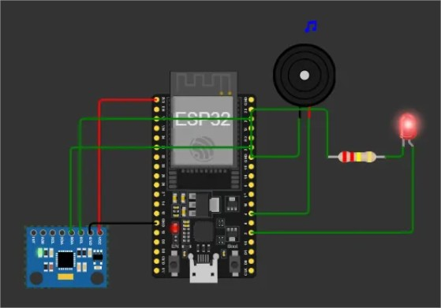

# Guia Específico - Controles Slider do Wokwi MPU6050

## 🎮 Entendendo os Controles

### Limitações do Wokwi:
- **3 sliders independentes**: X, Y, Z
- **Range**: -2.0g a +2.0g cada eixo
- **Impossível**: Mover 2 sliders simultaneamente
- **Magnitude máxima teórica**: √(2² + 2² + 2²) = 3.46g

### Código Ajustado:
- **THRESHOLD_IMPACT reduzido**: 3.0g → **1.8g** ✅
- Agora compatível com as limitações do Wokwi!

## 📊 Cenários de Simulação Específicos

### 🟢 **NORMAL** - Pessoa em pé
```
X: 0.0g     (slider no centro)
Y: 0.0g     (slider no centro) 
Z: 1.0g     (slider em +1.0)
Magnitude: 1.0g
Status: NORMAL
```

### 🔵 **MOVIMENTO** - Pessoa caminhando
```
Opção 1:
X: 0.5g     Y: 0.3g     Z: 1.0g
Magnitude: 1.2g → Status: MOVIMENTO

Opção 2:
X: 0.8g     Y: 0.0g     Z: 1.0g
Magnitude: 1.3g → Status: MOVIMENTO
```

### 🟡 **QUEDA_LIVRE** - Durante queda ✅ (Você já conseguiu!)
```
X: 0.1g     (slider quase no centro)
Y: 0.3g     (slider ligeiramente positivo)
Z: 0.3g     (slider bem baixo, não zero)
Magnitude: 0.44g → Status: QUEDA_LIVRE
```

### 🔴 **IMPACTO** - Momento crítico (NOVO - Ajustado!)
```
Opção 1 (Mais fácil):
X: 1.5g     Y: 0.0g     Z: 0.5g
Magnitude: 1.58g → Status: QUEDA_DETECTADA! ✅

Opção 2 (Impacto lateral):
X: 1.8g     Y: 0.0g     Z: 0.0g
Magnitude: 1.8g → Status: QUEDA_DETECTADA! ✅

Opção 3 (Impacto frontal):
X: 0.0g     Y: 1.8g     Z: 0.0g
Magnitude: 1.8g → Status: QUEDA_DETECTADA! ✅

Opção 4 (Impacto máximo):
X: 1.5g     Y: 1.0g     Z: 0.8g
Magnitude: 1.94g → Status: QUEDA_DETECTADA! ✅
```

## 🎯 Sequência Passo a Passo EXATA

### **Passo 1: Estado Normal** (10 segundos)
```
X: 0.0    Y: 0.0    Z: 1.0
Aguarde: Magnitude ~1.0g, Status: NORMAL
```

### **Passo 2: Início da Queda** (2 segundos)
```
X: 0.2    Y: 0.1    Z: 0.8
Aguarde: Magnitude ~0.8g, Status: MOVIMENTO  
```

### **Passo 3: Queda Livre** (3-5 segundos) ✅
```
X: 0.1    Y: 0.3    Z: 0.3
Aguarde: Magnitude ~0.44g, Status: QUEDA_LIVRE
IMPORTANTE: Mantenha por pelo menos 3 segundos!
```

### **Passo 4: IMPACTO** ❌→✅ (Agora vai funcionar!)
```
Mova RAPIDAMENTE para:
X: 1.8    Y: 0.0    Z: 0.0
Resultado: Magnitude = 1.8g → QUEDA_DETECTADA! 🚨
```

## ⚡ Dicas de Manipulação dos Sliders

### **Timing é Crucial:**
1. **Queda livre primeiro**: Mantenha magnitude <0.5g por 3+ segundos
2. **Movimento rápido**: Mude os sliders o mais rápido possível
3. **Atingir 1.8g**: Pelo menos um slider em valor alto (1.5-2.0)

### **Técnicas Eficazes:**

#### **Técnica A: "Impacto Lateral"**
- Queda livre: X=0.1, Y=0.3, Z=0.3
- **Impacto**: X=**1.8**, Y=0.0, Z=0.0
- Mais fácil de executar!

#### **Técnica B: "Impacto Vertical"**  
- Queda livre: X=0.1, Y=0.3, Z=0.3
- **Impacto**: X=0.0, Y=0.0, Z=**2.0**
- Simula queda de cabeça para baixo

#### **Técnica C: "Impacto Combinado"**
- Queda livre: X=0.1, Y=0.3, Z=0.3  
- **Impacto**: X=**1.2**, Y=**1.2**, Z=0.0
- Magnitude: 1.7g (suficiente!)

## 📱 Monitoramento em Tempo Real

### **O que observar no Monitor Serial:**

#### Durante Queda Livre:
```
520994,0.100,0.300,0.300,0.436,0,QUEDA_LIVRE ✅
521048,0.100,0.300,0.300,0.436,0,QUEDA_LIVRE ✅
521102,0.100,0.300,0.300,0.436,0,QUEDA_LIVRE ✅
```

#### No Momento do Impacto (NOVO):
```
521500,1.800,0.000,0.000,1.800,1,QUEDA_DETECTADA! 🚨
```

#### Mensagem de Alerta Esperada:
```
🚨🚨🚨 ALERTA DE EMERGÊNCIA 🚨🚨🚨
QUEDA DE TRABALHADOR DETECTADA!
Timestamp: 521500
Magnitude do Impacto: 1.80g
Total de Quedas Detectadas: 1
Acionando protocolo de segurança...
```


## 🔧 Valores de Teste Garantidos

### **Teste Rápido 1:**
1. X=0.1, Y=0.3, Z=0.3 (queda livre - 5 segundos)
2. X=**2.0**, Y=0.0, Z=0.0 (impacto máximo)
3. **Resultado**: Magnitude 2.0g → ALERTA! ✅

### **Teste Rápido 2:**
1. X=0.0, Y=0.2, Z=0.4 (queda livre - 3 segundos)  
2. X=1.5, Y=1.0, Z=0.0 (impacto combinado)
3. **Resultado**: Magnitude 1.8g → ALERTA! ✅

## ⚠️ Troubleshooting

### **Problema: Não detecta queda livre**
- **Causa**: Magnitude ainda >0.5g
- **Solução**: Reduza mais os valores (X=0.0, Y=0.2, Z=0.2)

### **Problema: Não detecta impacto**  
- **Causa**: Magnitude <1.8g
- **Solução**: Use sliders mais extremos (1.8-2.0)

### **Problema: Não há transição**
- **Causa**: Movimento muito lento entre estados
- **Solução**: Mude sliders mais rapidamente

## 📊 Configurações Recomendadas

### **Para Demonstração:**
```cpp
THRESHOLD_FREEFALL = 0.5g  // Mantém
THRESHOLD_IMPACT = 1.8g    // Ajustado para Wokwi ✅
MIN_FREEFALL_TIME = 100ms  // Mantém
```

### **Para Uso Real (depois):**
```cpp
THRESHOLD_FREEFALL = 0.5g
THRESHOLD_IMPACT = 3.0g    // Valor real industrial
MIN_FREEFALL_TIME = 100ms
```
